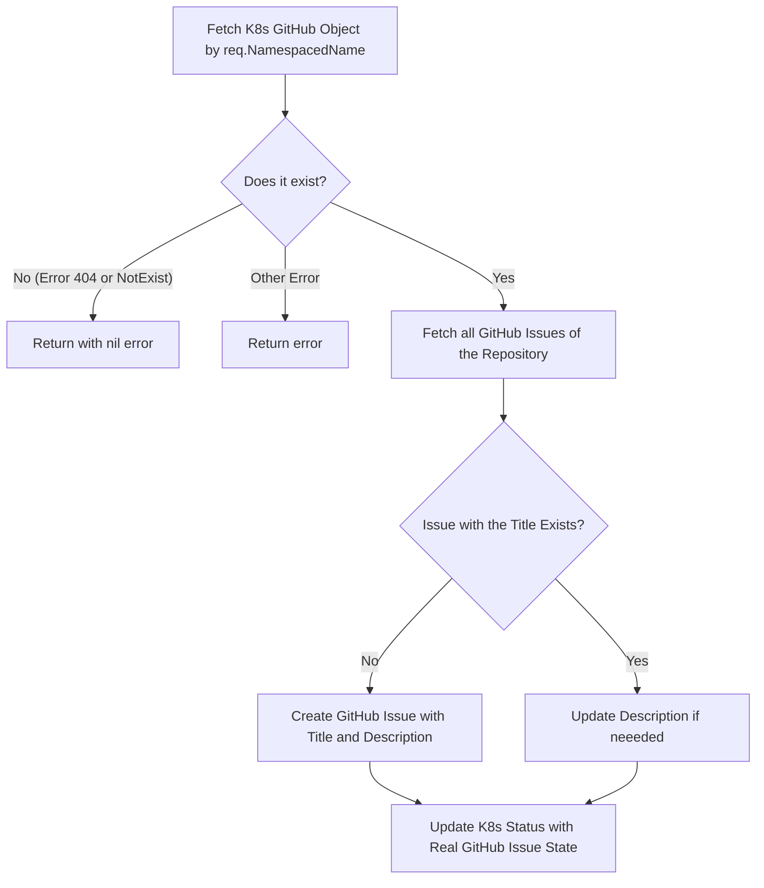

# github-issue-controller
A repo for an example k8s controller that creates issues

# how to work with this repo
[ ] clone this repo
[ ] generate a kubernetes controller using the operator-sdk https://sdk.operatorframework.io/docs/building-operators/golang/quickstart/
[ ] regulary push your work to your fork
[ ] use this repo to create issue from the controller you created. (contact me for the api token)

# controller creation chcek list
Using the operator SDK you created a Custom Resource that the controller watches. Its properties should be:
1. The `kind` should be something like `GitHubIssue`
2. The version should be `v1alpha1`
3. The specification or the so called `Spec` of the object should allow to define
  - the owner/repo of the repo. In our case the value should be `rgolangh/github-issue-controller`.
  - a title for the issue
  - a description for the issue
4. The status of the real github issue in github.com should be saved to  `Status`. Those properties are expected:
  - the status of the issue (like 'closed', 'open')
  - the full url of the issue (i.e https://github.com/some/repo/issues/1)

# controller reconciliation behaviour
- fetch the k8s github object by the req.NamespacedName:
- If it doesn't exist (error 404 or NotExist) - return with nil error. Any other error shall be returned.
- fetch all the github issues of the repository. Find one with the exact title you need.
- If it doesn't exist   ->   create a github issue with the title and description.
- If it exists              ->   update the description (if needed).
- update the k8s status with the real github issue state.

